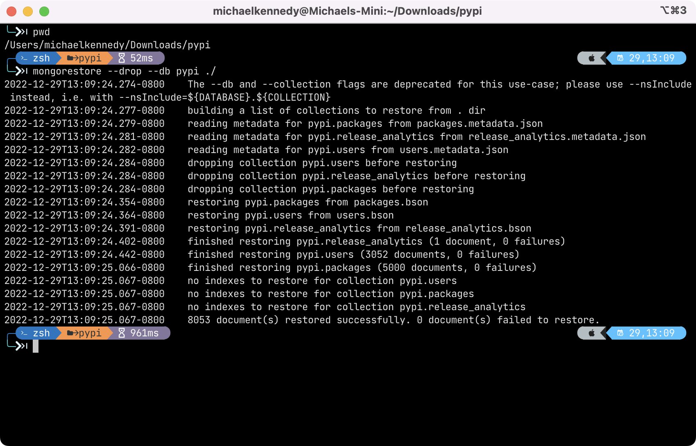

# Data for the course

This course uses custom data from [PyPI](https://pypi.org) sources. 

Start by **installing MongoDB** ([steps](https://www.mongodb.com/docs/manual/administration/install-community/)) and **MongoDB Management Tools** ([steps](https://www.mongodb.com/docs/database-tools/installation/installation/)). Start the MongoDB server running as well as the management tools binaries in the path.

**Download the data** from Talk Python at:

[https://talkpython.fm/pypi5k](https://talkpython.fm/pypi5k)

Unzip the data temporarily wherever you like. Let's assume the downloaded `pypi-5k-mongodb-dump.zip` file is in `~/Downloads/`. Then once you uncompress it, there will be a `pypi` folder with many `*.bson` and `*.json` files. **In that directory** (e.g. `~/Downloads/pypi`), run this command:

```bash
mongorestore --drop --db pypi ./
```

You should see output roughly analogous to:



Note that we did not restore all the indexes you would want for this data. Rather, that will be added when we get to the performance section of the course.
